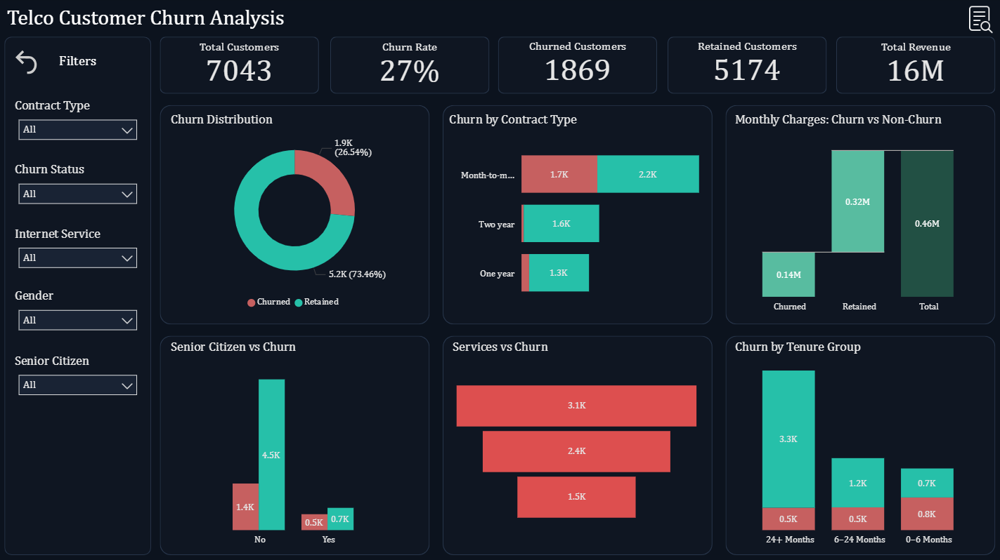
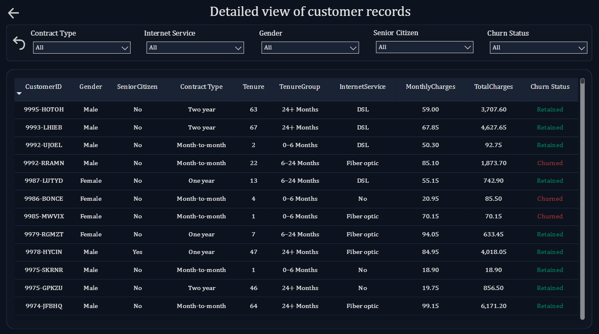

# 📊 Telco Customer Churn Analysis
**Advanced Power BI Project**

## 📌 Overview
This project analyzes customer churn for a telecommunications company using an **interactive Power BI dashboard**.  
The objective is to identify factors driving churn, segment high-risk customers, and provide actionable recommendations to improve retention.

---

## 📌 Key Features
- **KPIs:** Total Customers, Churn Rate, Churned Customers, Retained Customers, Total Revenue  
- **Filters:** Contract Type, Churn Status, Internet Service, Gender, Senior Citizen
- **Advanced Feature:** Reset Filters button for one-click clearing  
- **Customer Details Page:** Table with interactive filters

---

## ⭐ STAR Method Breakdown

### **S — Situation** 
The business was experiencing significant customer churn, impacting revenue and long-term growth. Understanding churn drivers was essential to improve retention.

### **T — Task**
Analyze customer demographics, services, and contract details to uncover churn patterns and actionable insights.

### **A — Action**
- Cleaned and preprocessed the dataset using Power Query
- Created DAX measures (e.g., Churn Rate, Retained Customers, Total Revenue, Tenure Groups)   
- Built an interactive Power BI dashboard with KPIs, filters, and business-focused visuals
- Implemented a Reset Filters button for advanced interactivity  

### **R — Result**
- Identified **Month-to-Month contract customers** as the highest churn risk segment  
- Found **customers with tenure <6 months** contribute the largest share of churn  
- Observed customers with fewer services churn significantly more  
- Enabled stakeholders to filter, explore, and prioritize high-risk segments efficiently  

---

## 📊 Dashboards
### 1️⃣ Churn Analysis
Identifying churn drivers and high-risk customer segments at a glance.
 

### 2️⃣ Customer Details
Drilling down into individual customers to support targeted retention actions.

---

## 🔗 Live Preview
([Live Dashboard](https://app.powerbi.com/groups/me/reports/f49977de-0d42-4831-9467-729fa0c5a0fb/3ca89191334e86e8cd43?experience=power-bi))

---

## 📌 Project Takeaways
- Strong relationship between **contract type, tenure, and churn**  
- Early intervention is critical for **new customers**  
- Service bundling reduces churn risk  
- Power BI dashboards can provide **actionable insights quickly to decision-makers**

---

## 📊 Tech Stack
- Power Query (Data Cleaning)
- Power BI (Dashboard & Visualizations)  
- DAX (KPIs & Measures)  
- Excel / CSV (Data Source)

---

## 🏁 Conclusion
This project shows how Power BI can be used to turn raw customer data into clear churn insights, helping businesses focus retention efforts on the customers who matter most.

---

## 👤 Author
**Shadan**   
_Data Analyst_

🔗 [LinkedIn Profile](https://www.linkedin.com/in/shadansarfaraz1)  
🔗 [Tableau Public Profile](https://public.tableau.com/app/profile/shadansarfaraz/vizzes)
🔗 [Newsletter](https://shadansarfaraz.substack.com/)

---

## ⭐ Show Your Support
If you found this project insightful, give it a **⭐ Star** on GitHub — it helps others discover it too!  
Connect on **LinkedIn** for more Power BI, Tableau, and Data Analytics projects.